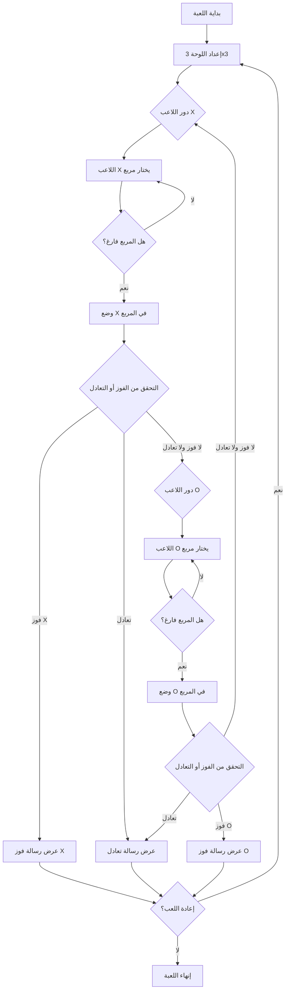

# مخطط لعبة Tic Tac Toe

```mermaid
flowchart TB
    A[بداية اللعبة] --> B[إعداد اللوحة 3x3]

    B --> C{دور اللاعب X}
    C --> D[اللاعب X يختار مربع]
    D --> E{هل المربع فارغ؟}
    E -- نعم --> F[وضع X في المربع]
    E -- لا --> D
    F --> G{التحقق من الفوز أو التعادل}
    G -- فوز X --> H[عرض رسالة فوز X]
    G -- تعادل --> I[عرض رسالة تعادل]
    G -- لا فوز ولا تعادل --> J{دور اللاعب O}
    J --> K[اللاعب O يختار مربع]
    K --> L{هل المربع فارغ؟}
    L -- نعم --> M[وضع O في المربع]
    L -- لا --> K
    M --> N{التحقق من الفوز أو التعادل}
    N -- فوز O --> O[عرض رسالة فوز O]
    N -- تعادل --> I
    N -- لا فوز ولا تعادل --> C

    H --> P{إعادة اللعب؟}
    I --> P
    O --> P
    P -- نعم --> B
    P -- لا --> Q[إنهاء اللعبة]
```
